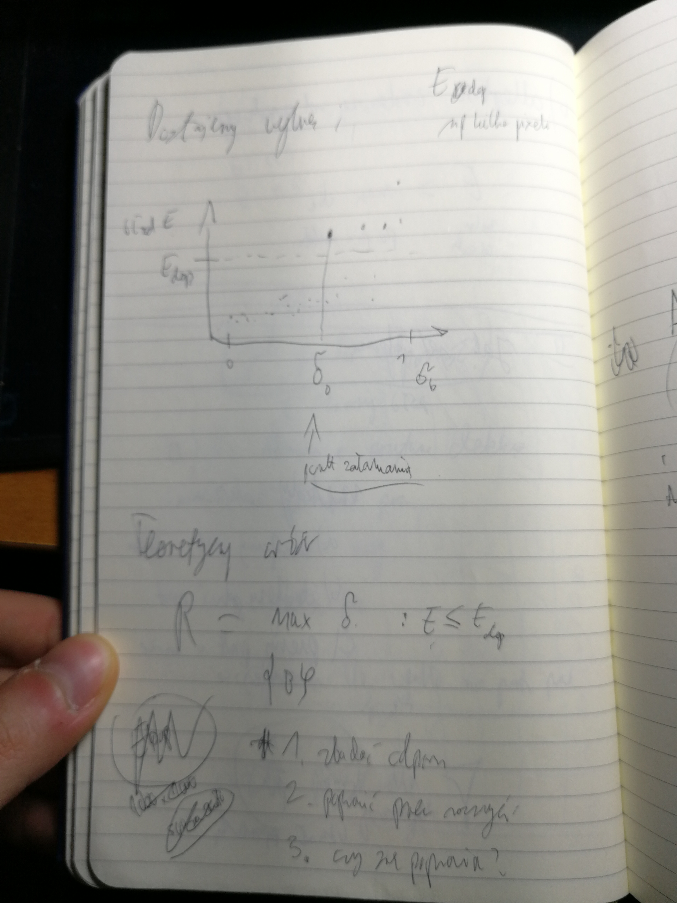
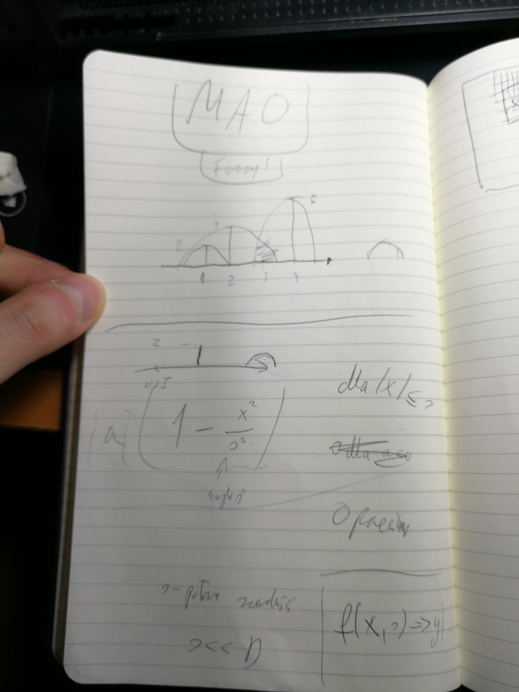
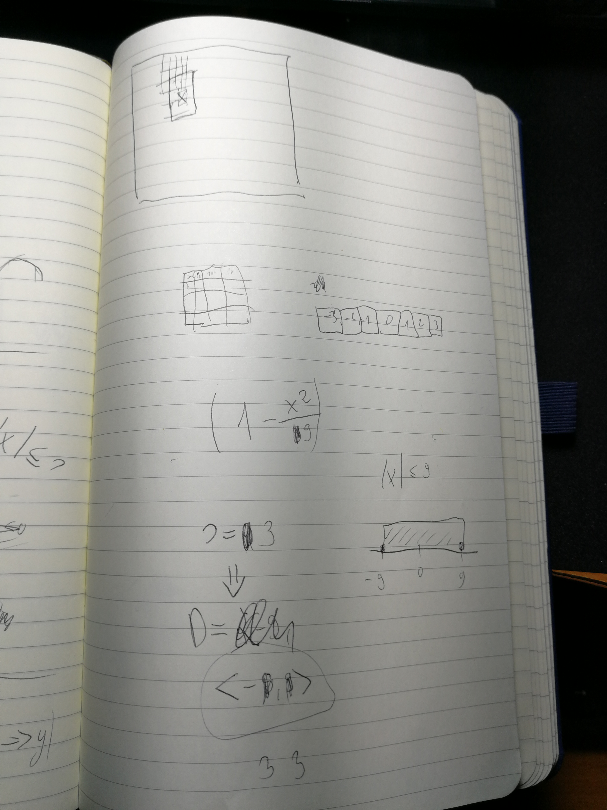

# Polecenia projektu
1. Wziąć detektor i znaleźć punkt załamania
2. Zbadać odporność
3. Ustalić jaka jest konkretna odporność
4. poprawić przez rozmycie
5. sprawdzić czy się poprawiło

# z fb
"Może być Sobel i może być detekcja okręgów, ale trzeba to zrobić ładnie, pokazać mu odporność tego algorytmu, błędy i jakieś wyniki tego. (Oddałem już w sumie, więc sprawdzone źródło.)"

# Jak sprawdzić odporność?
Prawdziwe pozytywne detekcje
Fałszywe pozytywne detekcje
Prawdziwe negatywne
Fałszywe negatywne

Sprawdzić pixeli wpadło na prostą 
**Zły pomysł dla prostych!**

# Odległość znalezionej od prawdziwej
E       =    max d_i
miara        po pixelach obiektu
błędu

# Metody zakłócania:
* usuwamy punkt z okręgu
* dodajemy gdzieś punkt
* przesuwamy punkt z okręgu w losowe miejsce

# Udział popsutych
delta_b = N_t / N

